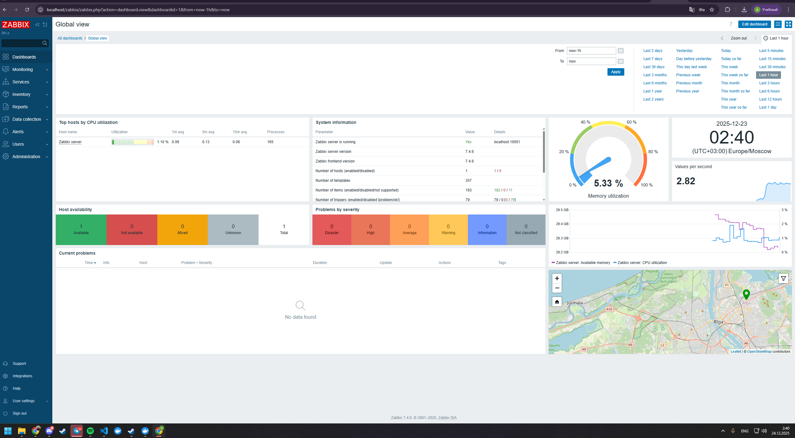
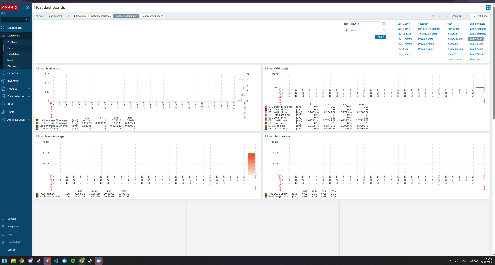
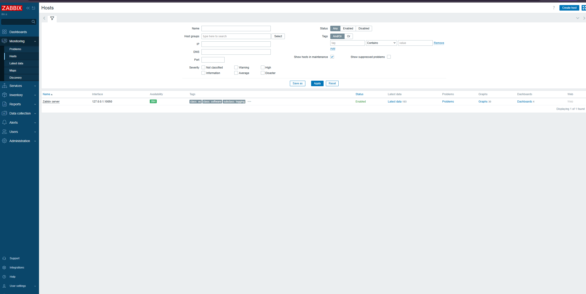
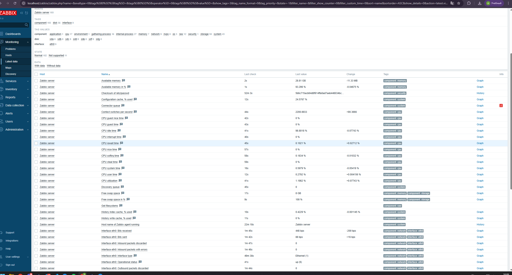
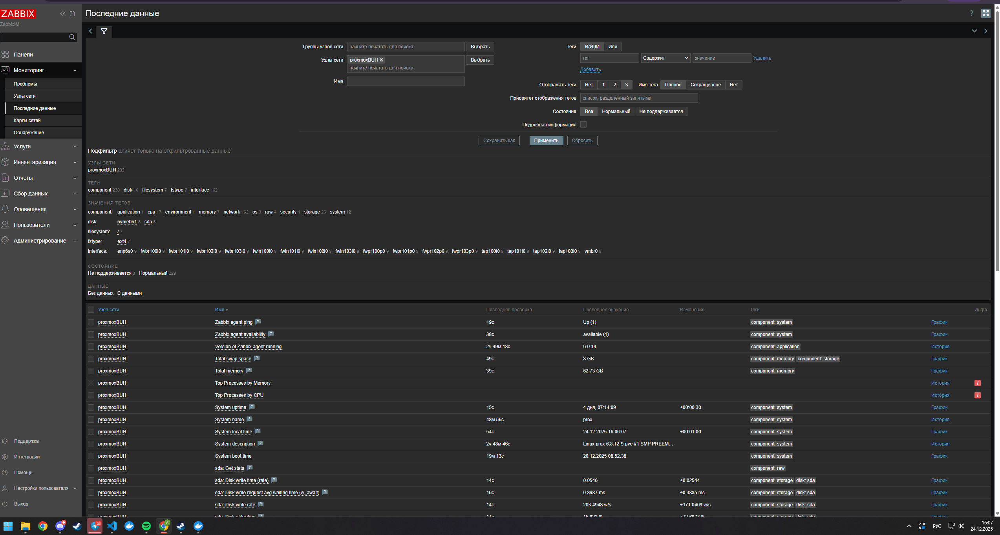
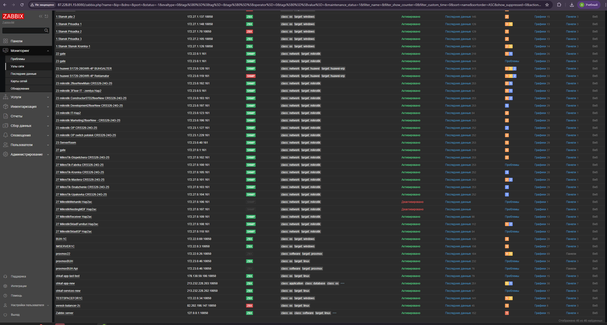

# Домашнее задание к занятию "`Система мониторинга Zabbix`" - `Ильин Алексей`

Задание 1
Установите Zabbix Server с веб-интерфейсом.

Процесс выполнения
Выполняя ДЗ, сверяйтесь с процессом отражённым в записи лекции.
Установите PostgreSQL. Для установки достаточна та версия, что есть в системном репозитороии Debian 11.
Пользуясь конфигуратором команд с официального сайта, составьте набор команд для установки последней версии Zabbix с поддержкой PostgreSQL и Apache.
Выполните все необходимые команды для установки Zabbix Server и Zabbix Web Server.
Требования к результатам
Прикрепите в файл README.md скриншот авторизации в админке.
Приложите в файл README.md текст использованных команд в GitHub.
### Задание 1
 # Скриншот аваторизации в админке
 1.  
`Устанавлива актуальную версию Zabbix 7.4.6	вместо предложенной 6.0, так как хотелось выполнить работу на актуальной платформе, так же вместо древней версии debian 11 дистрибутив которой нельзя установить на wsl,использовал Ubuntu 24.04.3 LTS `
2. `Список введенных мной команд`
root@kukbobPC:/home/ilin# history
    1  wget https://repo.zabbix.com/zabbix/7.4/release/ubuntu/pool/main/z/zabbix-release/zabbix-release_latest_7.4+ubuntu24.04_all.deb
    2  dpkg -i zabbix-release_latest_7.4+ubuntu24.04_all.deb
    3  apt update
    4  apt install zabbix-server-pgsql zabbix-frontend-php php8.3-pgsql zabbix-apache-conf zabbix-sql-scripts zabbix-agent
    5  sudo -u postgres createuser --pwprompt zabbix
    6  mysql -uroot -p
    7  apt install zabbix-server-mysql zabbix-frontend-php zabbix-apache-conf zabbix-sql-scripts zabbix-agent
    8  mysql -uroot -p
    9  systemctl stop zabbix-server
   10  apt remove --purge zabbix-server-mysql -y
   11  apt remove --purge mysql-server -y
   12  apt install zabbix-server-pgsql postgresql postgresql-contrib -y
   13  sudo -u postgres psql
   14  sudo -u zabbix zcat /usr/share/zabbix-sql-scripts/postgresql/server.sql.gz | sudo -u postgres psql zabbix
   15  find /usr/share -name "server.sql.gz" 2>/dev/null
   16  sudo -u zabbix zcat /usr/share/zabbix/sql-scripts/postgresql/server.sql.gz | sudo -u postgres psql zabbix
   17  /etc/zabbix/zabbix_server.conf
   18  nano /etc/zabbix/zabbix_server.conf
   19  systemctl restart postgresql
   20  systemctl start zabbix-server
   21  systemctl status zabbix-server.service
   22  tail -50 /var/log/zabbix/zabbix_server.log
   23  sudo -u postgres psql
   24  systemctl restart zabbix-server
   25  systemctl status zabbix-server
   26  systemctl restart apache2
   27  systemctl status postgresql zabbix-server apache2
   28  apt install locales -y
   29  nano /etc/locale.gen
   30  locale-gen
   31  update-locale LANG=en_US.UTF-8
   32  export LANG=en_US.UTF-8
   33  exit
   34  history
root@kukbobPC:/home/ilin# 

### Задание 2

Установите Zabbix Agent на два хоста.

Процесс выполнения
Выполняя ДЗ, сверяйтесь с процессом отражённым в записи лекции.
Установите Zabbix Agent на 2 вирт.машины, одной из них может быть ваш Zabbix Server.
Добавьте Zabbix Server в список разрешенных серверов ваших Zabbix Agentов.
Добавьте Zabbix Agentов в раздел Configuration > Hosts вашего Zabbix Servera.
Проверьте, что в разделе Latest Data начали появляться данные с добавленных агентов.
Требования к результатам
Приложите в файл README.md скриншот раздела Configuration > Hosts, где видно, что агенты подключены к серверу
Приложите в файл README.md скриншот лога zabbix agent, где видно, что он работает с сервером
Приложите в файл README.md скриншот раздела Monitoring > Latest data для обоих хостов, где видны поступающие от агентов данные.
Приложите в файл README.md текст использованных команд в GitHub

1. Заббикс агент на сервере заббикса   
2. Заббикс агент на "Боевом сервере" заббикса, который я уже разворачива на selectel  
3. На боевом сервере облачный заббикс связан туннелями с общим виртуальным провайдером и адреса вытягивает по BGP 
4. установка агента выглядит так: 
sudo apt update && sudo apt install wget -y
wget https://repo.zabbix.com/zabbix/7.4/release/ubuntu/pool/main/z/zabbix-release/zabbix-release_7.4-1+ubuntu24.04_all.deb
sudo dpkg -i zabbix-release_7.4-1+ubuntu24.04_all.deb
sudo apt update
sudo apt install zabbix-agent -y
sudo nano /etc/zabbix/zabbix_agentd.conf
sudo systemctl start zabbix-agent
sudo systemctl enable zabbix-agent
sudo systemctl status zabbix-agent
